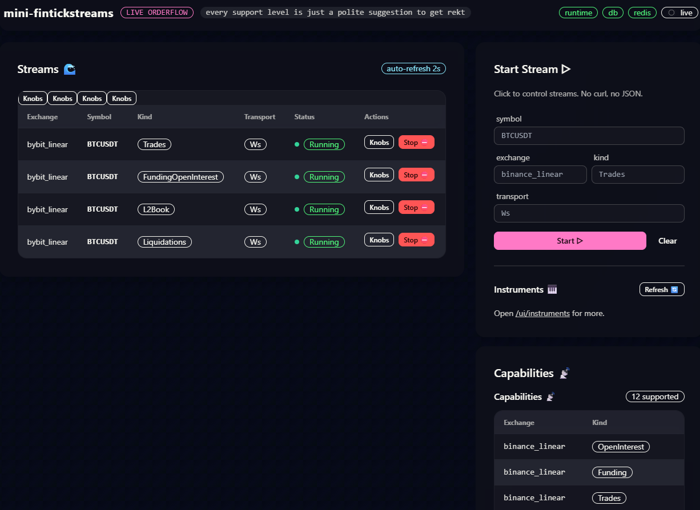

# 🦀 mini-fintickstreams

**Blazingly fast ⚡ tick-level financial market data firehose.**

[Features](#-key-capabilities) • [Architecture](#-system-design) • [Quick Start](#-get-moving) • [Discord](https://discord.gg/wG49SpsM)

---

## 🖼️ UI Control Plane
Zero CLI wrestling. Manage your entire data pipeline from a built-in Axum web interface.

  
   
  <em>Left: Live stream monitoring | Right: Real-time per-stream "knobs" & limiters</em>

---

## 🚀 Key Capabilities

| Feature | Description |
| :--- | :--- |
| **⚡ Dual Transport** | Primary **WebSocket** streams with automatic **HTTP polling** fallback. |
| **📊 Data Types** | Full coverage: Trades, L2 Books, Funding, Open Interest, and Liquidations. |
| **💾 Persistence** | High-speed ingest via **TimescaleDB** hypertables & **Redis** pub-sub. |
| **🔍 Observability** | Native **Prometheus** `/metrics` and structured `tracing` logs. |
| **⚙️ Dynamic Runtime** | Hot-swappable streams; toggle DB writes on-the-fly without restarts. |

---

### 🔌 Supported Exchanges
| **Exchange** | **Instrument Type** | **Connectivity** |
| :--- | :--- | :--- |
| **Binance** | Linear Futures | WS + HTTP Fallback |
| **Hyperliquid** | Perpetuals (Perps) | WS + HTTP Fallback |
| **Bybit** | Linear Futures | WS + HTTP Fallback |

---

## 🏗 System Design

A modular architecture built for 24/7 reliability.

* **AppRuntime:** Centralized state, dependency injection, and health management.
* **Stream Workers:** Dedicated async tasks per `(exchange, symbol, kind)`.
* **Control Plane:** REST API (Axum) for dynamic orchestration.
* **Safety Layer:** Intelligent rate-limiting and backoff logic to protect your IPs.

---

## 🏁 Get Moving

| Step | Action | Command/Link |
| :--- | :--- | :--- |
| **1** | **Spin up Infra** | PostgreSQL (Timescale) + Redis |
| **2** | **Launch App** | `cargo run --release` |
| **3** | **Open Dashboard** | [http://127.0.0.1:8080/ui](http://127.0.0.1:8080/ui) |
| **4** | **Check Metrics** | [http://127.0.0.1:8080/metrics](http://127.0.0.1:8080/metrics) |

---

## 🤝 Let's Build

Whether you're training ML models or running high-frequency algos, clean data is the bottleneck. Let’s fix that together.

* **Discord:** [Join the Alpha](https://discord.gg/wG49SpsM)
* **Contribute:** PRs for new exchanges or data types are prioritized.

> !WARNING
> **Operator Responsibility:** You are responsible for your own API rate limits. Use the Prometheus dashboard to monitor your usage and avoid exchange bans.
